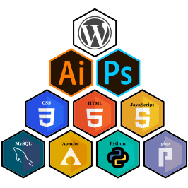
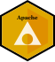

<!--**BrandonWeigand/BrandonWeigand** (this file) appears on your GitHub profile.-->

[Brandon Weigand](https://brandonweigand.github.io/BrandonWeigand/)

# images load
<!---->
 
 
 
 
 
 
 
 
 

# stats

